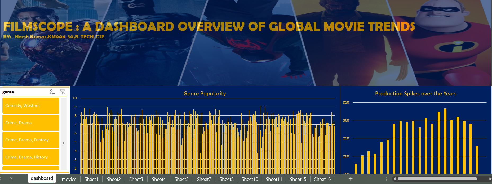

# portfolio
Personal Portfolio Website built with Flask, HTML, CSS, and JavaScript.  Showcasing my projects, skills, and contact form with email integration.

# 🌐 Personal Portfolio Website  

A clean and responsive personal portfolio website built using **Flask**, **HTML**, **CSS**, and **JavaScript**.  
This site highlights my **skills, projects, and experience**, and includes a **contact form with email integration** to get in touch easily.  

---

## 🚀 Features  

- 🎨 **Responsive Design** – Works across desktop, tablet, and mobile.  
- 🛠️ **Projects Showcase** – Displaying my top projects with descriptions, tech stack tags, and images.  
- 📊 **Skills Section** – Interactive progress bars showing my tech expertise.  
- 📩 **Contact Form** – Integrated with Flask-Mail to send emails directly to me.  
- ⚡ **SweetAlert Popup** – Success notification when a message is sent.  

---

## 🛠️ Tech Stack  

- **Backend:** Flask (Python)  
- **Frontend:** HTML5, CSS3, JavaScript  
- **Database (optional for projects):** SQLAlchemy / MongoDB (if needed)  
- **Email Service:** Flask-Mail (Gmail SMTP)  
- **Styling:** Custom CSS (with animations & floating labels)  

---

## 📷 Screenshots  

### Homepage  
  

### Projects Section  
  

---

## ⚙️ Installation & Setup  

1. **Clone the repository**  
   ```bash
   git clone https://github.com/yourusername/portfolio-website.git
   cd portfolio-website
2. **Create a virtual environment**
   python -m venv venv
source venv/bin/activate   # On Linux/Mac
venv\Scripts\activate      # On Windows

3. **Install dependencies**
   pip install -r requirements.txt

4. **Set up environment variables (for email)**
   Create a .env file in the root folder with:
   MAIL_SERVER=smtp.gmail.com
  MAIL_PORT=465
  MAIL_USE_SSL=True
  MAIL_USERNAME=your_email@gmail.com
  MAIL_PASSWORD=your_app_password

5. **Run the Flask app**
   python app.py
